# OpenClaw Gateway Chatbot — 后端类设计

> Spring Boot 后端核心类图、接口映射与协作关系。

---

## 1. 系统分层总览

后端分为三个核心层与一组模型/DTO 类：

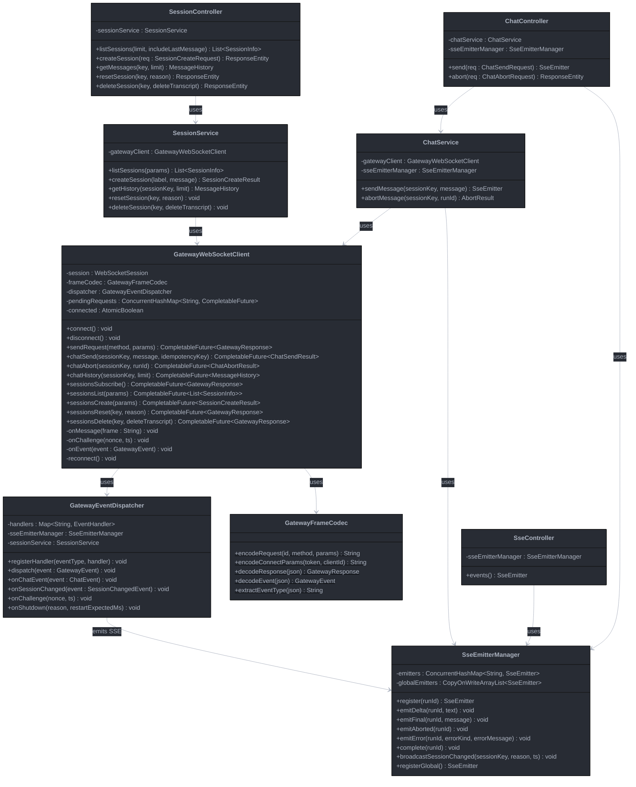

**层次职责：**

| 层 | 类 | 职责 |
|----|-----|------|
| **Controller** | `ChatController`, `SessionController`, `SseController` | HTTP 端点、请求校验、响应封装 |
| **Service** | `ChatService`, `SessionService`, `SseEmitterManager` | 业务编排、SSE 生命周期管理 |
| **Gateway Client** | `GatewayWebSocketClient`, `GatewayFrameCodec`, `GatewayEventDispatcher` | WS 协议交互、帧编解码、事件路由 |

---

## 2. Controller 层详细设计

### 2.1 ChatController

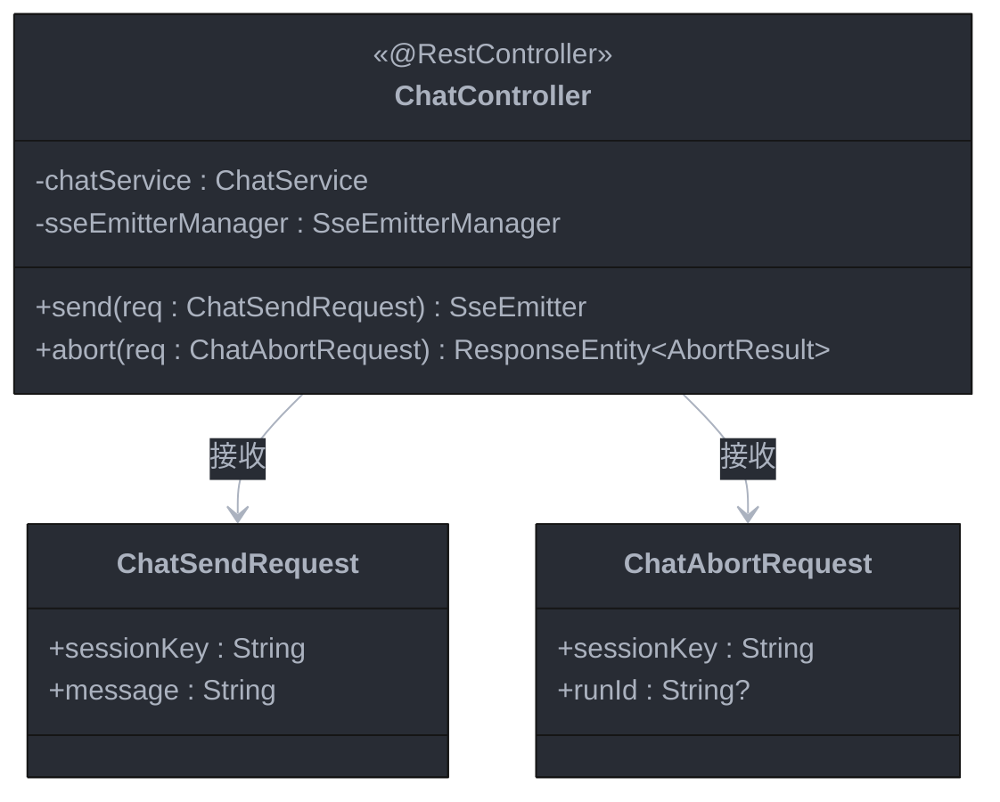

**接口映射：**

| 方法 | HTTP 端点 | 内部调用链 |
|------|----------|-----------|
| `send()` | `POST /api/chat/send` | `chatService.sendMessage()` → 注册 SseEmitter → 返回 SSE 流 |
| `abort()` | `POST /api/chat/abort` | `chatService.abortMessage()` → 同步返回 JSON |

---

### 2.2 SessionController

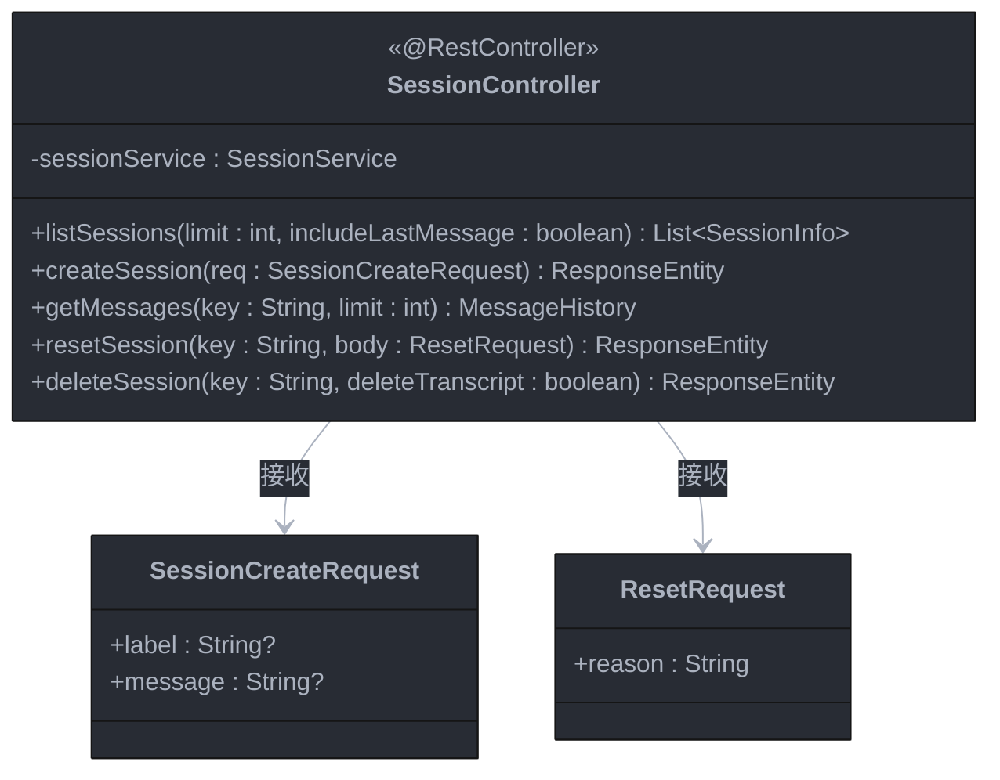

**接口映射：**

| 方法 | HTTP 端点 | 内部调用链 |
|------|----------|-----------|
| `listSessions()` | `GET /api/sessions` | `sessionService.listSessions()` → `sessions.list` RPC |
| `createSession()` | `POST /api/sessions` | `sessionService.createSession()` → `sessions.create` RPC |
| `getMessages()` | `GET /api/sessions/{key}/messages` | `sessionService.getHistory()` → `chat.history` RPC |
| `resetSession()` | `POST /api/sessions/{key}/reset` | `sessionService.resetSession()` → `sessions.reset` RPC |
| `deleteSession()` | `DELETE /api/sessions/{key}` | `sessionService.deleteSession()` → `sessions.delete` RPC |

---

### 2.3 SseController

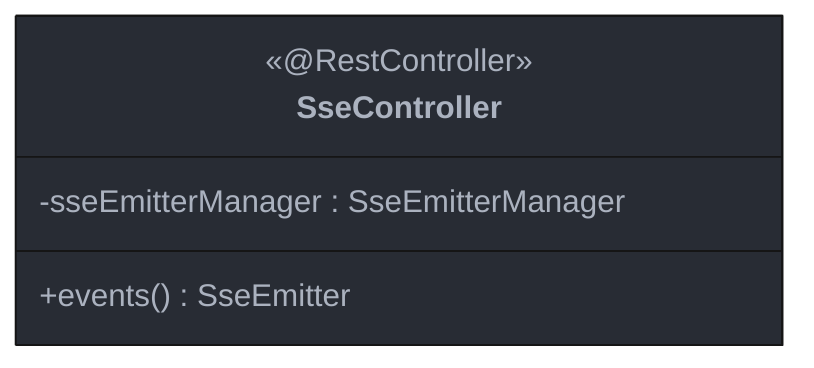

**说明：** `/api/events` 是一个全局 SSE 端点，用于推送 `sessions.changed` 等非 chat 相关的事件。`POST /api/chat/send` 的 SSE 流是独立的（每次请求创建一个），与此全局通道分离。

---

## 3. Service 层详细设计

### 3.1 ChatService

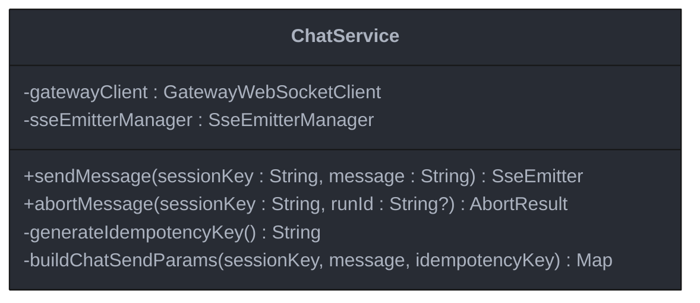

**`sendMessage()` 内部流程：**

```
1. idempotencyKey = generateIdempotencyKey()     // UUID
2. emitter = sseEmitterManager.register(id)       // 创建 SseEmitter
3. gatewayClient.chatSend(sessionKey, message, id) // 异步发送 WS RPC
4. 等待 ok:true → 返回 emitter                    // SSE 流开始
5. [异步] GatewayEventDispatcher 收到 chat event →
   sseEmitterManager.emitDelta/emitFinal/...       // 推送 SSE
6. [异步] 收到 final/aborted/error →
   sseEmitterManager.complete(id)                  // 关闭 SSE 流
```

### 3.2 SessionService

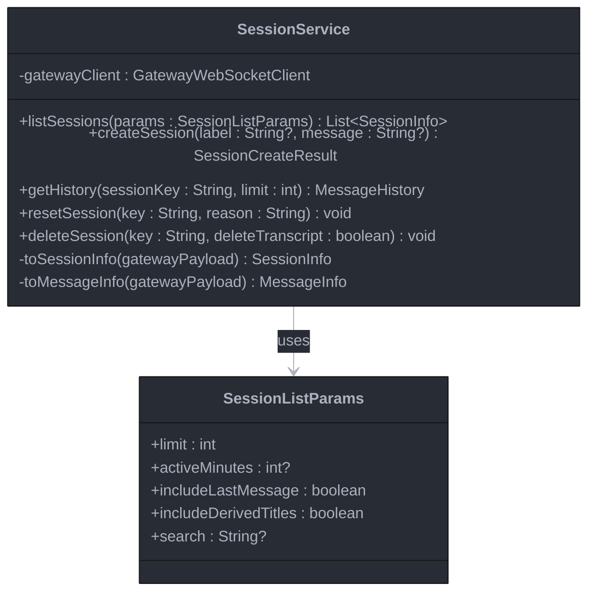

**说明：** `SessionService` 的方法都是同步阻塞的（通过 `CompletableFuture.get()` 等待 Gateway RPC 响应）。对于 `listSessions` 和 `getHistory`，直接将 Gateway 返回的 payload 转换为前端需要的 DTO 格式。

### 3.3 SseEmitterManager

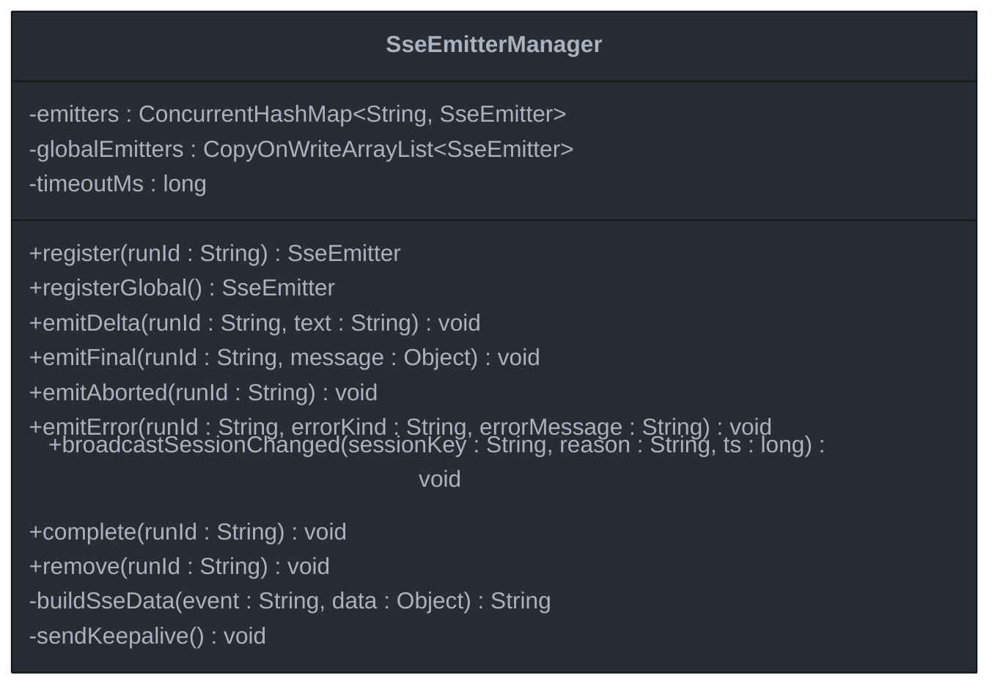

**SSE 事件格式映射：**

| 方法 | SSE event name | 说明 |
|------|---------------|------|
| `emitDelta()` | `chat.delta` | `data: {runId, text}` |
| `emitFinal()` | `chat.final` | `data: {runId, message}` |
| `emitAborted()` | `chat.aborted` | `data: {runId}` |
| `emitError()` | `chat.error` | `data: {runId, errorMessage, errorKind}` |
| `broadcastSessionChanged()` | `sessions.changed` | `data: {sessionKey, reason, ts}` |

---

## 4. Gateway Client 层详细设计

### 4.1 GatewayWebSocketClient

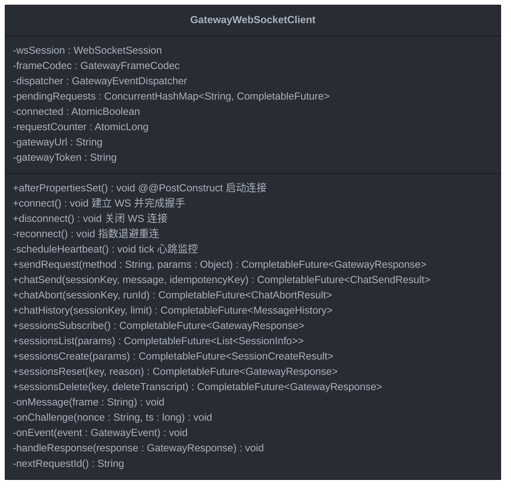

**RPC 方法与 Gateway 协议的映射：**

| Java 方法 | Gateway RPC method | 参数构建 |
|-----------|-------------------|---------|
| `chatSend()` | `"chat.send"` | `{sessionKey, message, idempotencyKey, deliver:false}` |
| `chatAbort()` | `"chat.abort"` | `{sessionKey, runId?}` |
| `chatHistory()` | `"chat.history"` | `{sessionKey, limit}` |
| `sessionsSubscribe()` | `"sessions.subscribe"` | `{}` |
| `sessionsList()` | `"sessions.list"` | `{limit, includeLastMessage, ...}` |
| `sessionsCreate()` | `"sessions.create"` | `{label?, message?}` |
| `sessionsReset()` | `"sessions.reset"` | `{key, reason}` |
| `sessionsDelete()` | `"sessions.delete"` | `{key, deleteTranscript}` |

**请求-响应匹配机制：**

`sendRequest()` 的工作流程：

```
1. reqId = nextRequestId()                    // 自增 ID
2. future = new CompletableFuture()
3. pendingRequests.put(reqId, future)          // 注册等待
4. json = frameCodec.encodeRequest(reqId, method, params)
5. wsSession.sendMessage(json)                 // 发送到 Gateway
6. return future                               // 调用方通过 .get() 阻塞等待
7. [异步] onMessage() 收到 res → handleResponse()
   → pendingRequests.remove(reqId)
   → future.complete(response)                 // 解除阻塞
```

---

### 4.2 GatewayFrameCodec

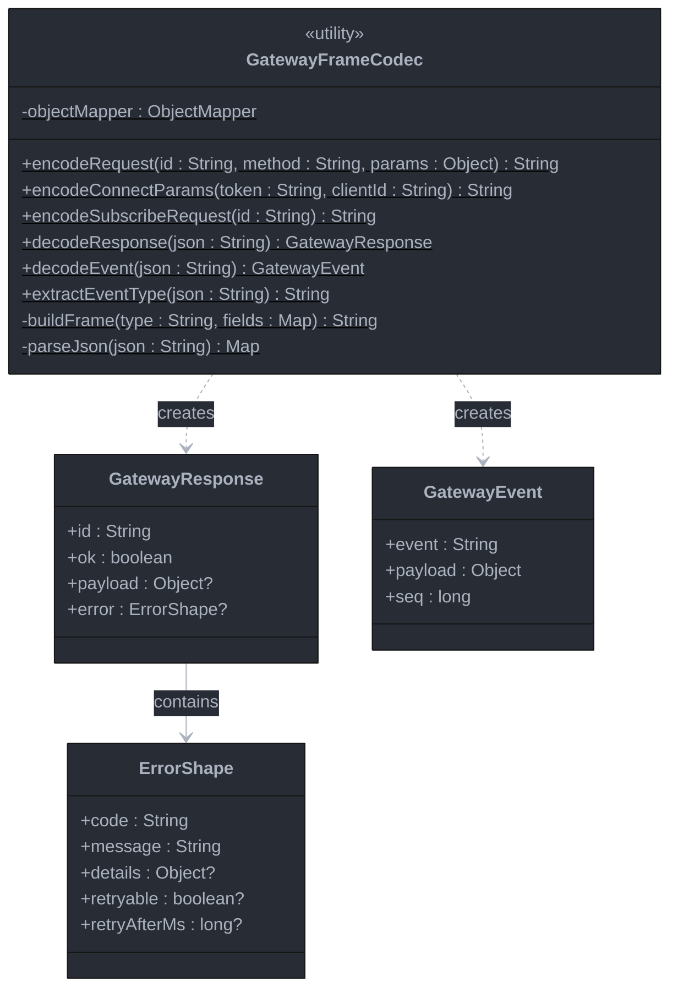

**说明：** `GatewayFrameCodec` 是无状态工具类，所有公开方法为 `static`。负责三种 Gateway 帧格式的序列化/反序列化：

| 帧类型 | 编码方法 | 解码方法 |
|--------|---------|---------|
| Request (`"req"`) | `encodeRequest()` | — |
| Response (`"res"`) | — | `decodeResponse()` |
| Event (`"event"`) | — | `decodeEvent()` |

---

### 4.3 GatewayEventDispatcher

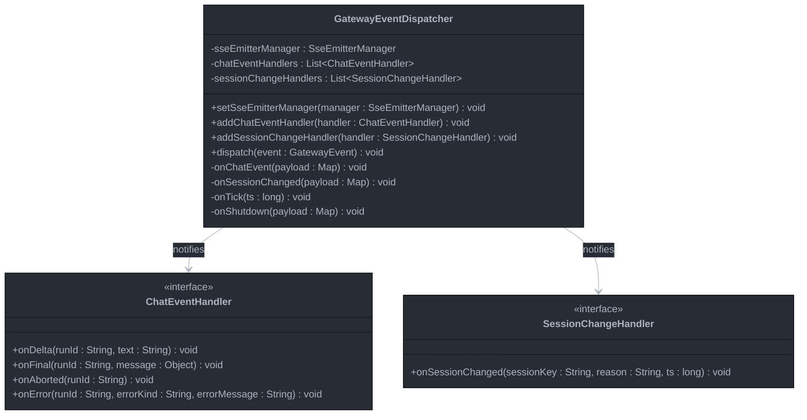

**事件路由逻辑：**

```
GatewayWebSocketClient.onMessage(json)
  → GatewayFrameCodec.extractEventType(json)
  → switch(eventType)
      case "chat"            → onChatEvent(payload)
                                 switch(state)
                                   "delta"   → sseEmitterManager.emitDelta()
                                   "final"   → sseEmitterManager.emitFinal() + complete()
                                   "aborted" → sseEmitterManager.emitAborted() + complete()
                                   "error"   → sseEmitterManager.emitError() + complete()
      case "sessions.changed" → onSessionChanged(payload)
                                  → sseEmitterManager.broadcastSessionChanged()
      case "tick"            → scheduleHeartbeat() // 重置心跳超时
      case "shutdown"        → onShutdown(payload) // 触发重连
```

---

## 5. 模型 / DTO 类

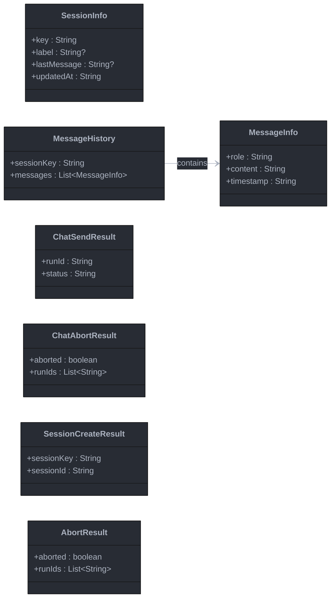

---

## 6. 核心协作流程

### 6.1 应用启动与 WebSocket 连接建立（挑战握手 + 设备签名连接）

本节从**后端类协作**角度总结 Gateway 的建连流程。对新的 operator 客户端，推荐把握手建模为：**WebSocket 建立后，按正常 operator 路径处理 `connect.challenge`，再发送带共享认证信息与 `device` 签名的 `connect` 请求；首次连接成功后持久化 `hello-ok.auth.deviceToken`，后续重连优先复用同一设备身份与已持久化的 device token。**

如果部署侧仍使用共享 token（例如通过环境变量 `OPENCLAW_GATEWAY_TOKEN` 注入），它属于**首次连接时的共享认证材料**，而不是“可替代设备身份的主流程”。在当前客户端实现里，token-only 更适合作为 plain HTTP / insecure compatibility 等受限场景下的回退路径，不应作为新后端客户端的默认建模方式。

**认证流程概览：**

```
WebSocket open → Gateway 按正常 operator 路径发 `connect.challenge` → Chatbot 使用共享认证信息 + `device` 签名发送 connect → Gateway 返回 hello-ok（含 deviceToken）→ Chatbot 持久化 deviceToken → 再订阅 sessions / 进入后续 RPC
```

按这一设计建模的原因：
1. **符合协议主路径**：`connect.challenge` 是新的 operator 客户端正常握手的一部分，不应被当成可忽略事件
2. **稳定承载设备身份与 scopes**：首次连接使用共享认证信息 + `device` 签名，更符合当前 Gateway 对 operator 客户端的建模
3. **建立可持续的重连路径**：首次成功后可持久化 `hello-ok.auth.deviceToken`，后续重连优先复用已批准的 device token
4. **保留兼容回退说明**：token-only 可能在不安全上下文或兼容模式下出现，但不应在类设计中被写成推荐主流程

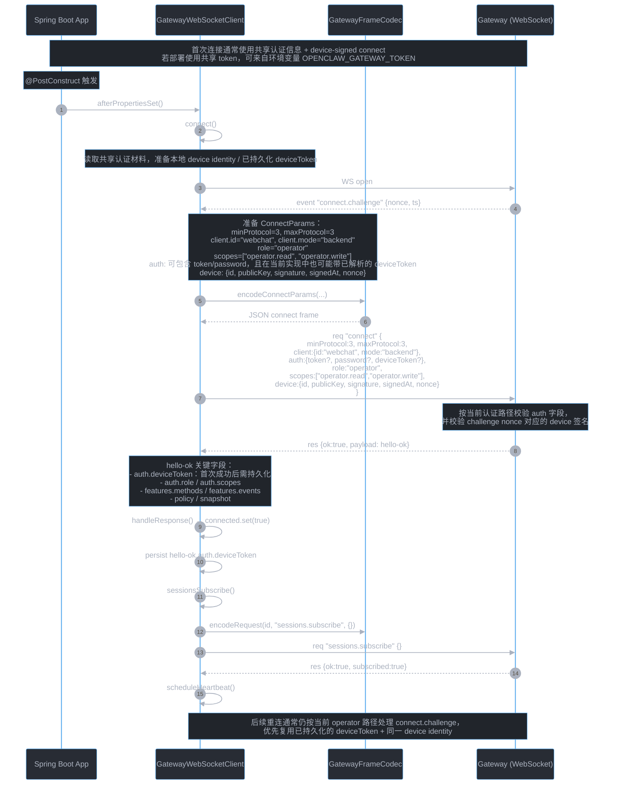

**关键点：**

| 要点 | 说明 |
|------|------|
| **共享认证材料来源** | 若部署使用共享 token，可由环境变量 `OPENCLAW_GATEWAY_TOKEN` 注入；它主要用于首次连接时的共享认证 |
| **典型握手顺序** | 正常 operator 路径通常表现为 `WS open` → `connect.challenge` → device-signed `connect` → `hello-ok` → 持久化 `auth.deviceToken` → 再发 `sessions.subscribe` 等后续 RPC |
| **首次连接认证方式** | 推荐使用共享 `token/password` + `device` 签名；在当前实现中，`auth` 里也可能携带已解析的 `deviceToken` |
| **重连认证方式** | 首次成功后持久化 `hello-ok.auth.deviceToken`，后续重连优先复用该 token，并保持同一 device identity |
| **connect.challenge** | challenge 中的 nonce 需要进入 `device` 签名 payload；对新的 operator 客户端，应把它视为正常握手路径的一部分 |
| **token-only 的定位** | 在当前客户端实现里，可作为 plain HTTP / insecure compatibility 等场景下的 fallback，但不应写成推荐主流程 |
| **连接生命周期** | `GatewayWebSocketClient` 在 `@PostConstruct` 阶段自动建连；收到 `hello-ok` 后再注册 `sessions.subscribe()` 并启动心跳监控 |
| **心跳监控** | `scheduleHeartbeat()` 监控 `tick` 事件，超时则触发 `reconnect()`；重连流程仍应重复 challenge + connect 链路 |

---

### 6.2 用户发送消息（HTTP → WS → SSE 全链路）

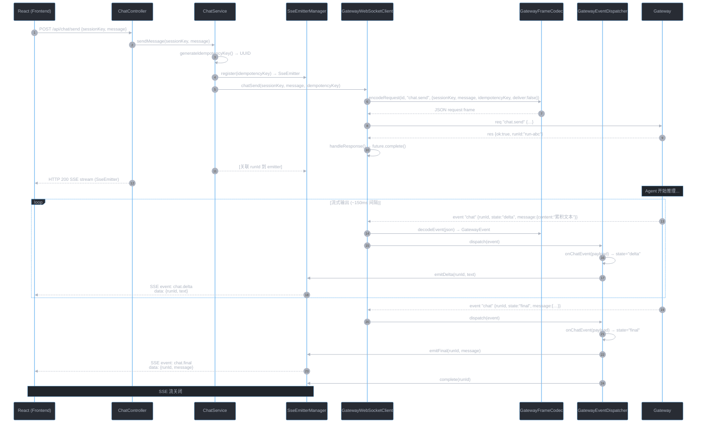

---

### 6.3 会话管理（以"创建新会话"为例）

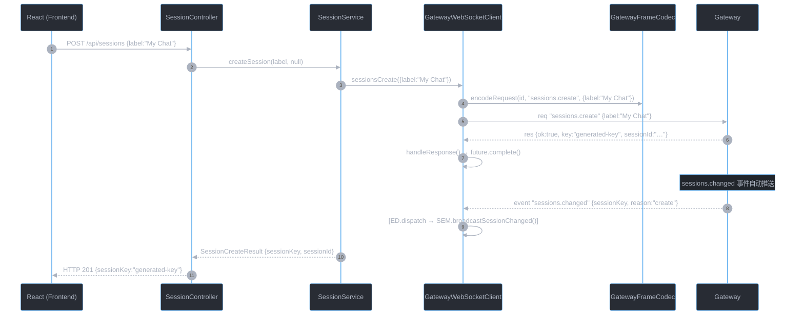

---

### 6.4 会话变更通知（自动推送）

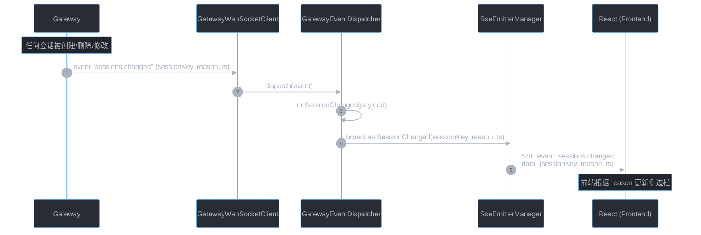

---

## 7. 设计决策总结

| 决策 | 说明 |
|------|------|
| **GatewayWebSocketClient 单例** | 单用户独占场景，全局只需一条持久 WS 连接。通过 `@Component` 自动管理 |
| **SseEmitterManager 管理生命周期** | `register(runId)` 创建 emitter，收到 final/aborted/error 后自动 `complete()`。超时由 Spring `SseEmitter` 默认超时机制兜底 |
| **GatewayFrameCodec 无状态** | 纯编解码工具类，所有方法为 static，不持有任何状态 |
| **GatewayEventDispatcher 回调驱动** | 通过 `ChatEventHandler` / `SessionChangeHandler` 接口解耦，方便测试和扩展 |
| **请求-响应异步匹配** | `pendingRequests` Map 以 request ID 为 key，`CompletableFuture` 实现 RPC 的请求-响应关联 |
| **delta 文本替换而非追加** | Gateway 协议保证 delta 包含完整累积文本，后端直接转发给前端替换显示 |
