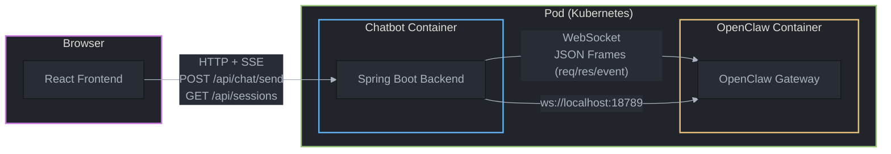
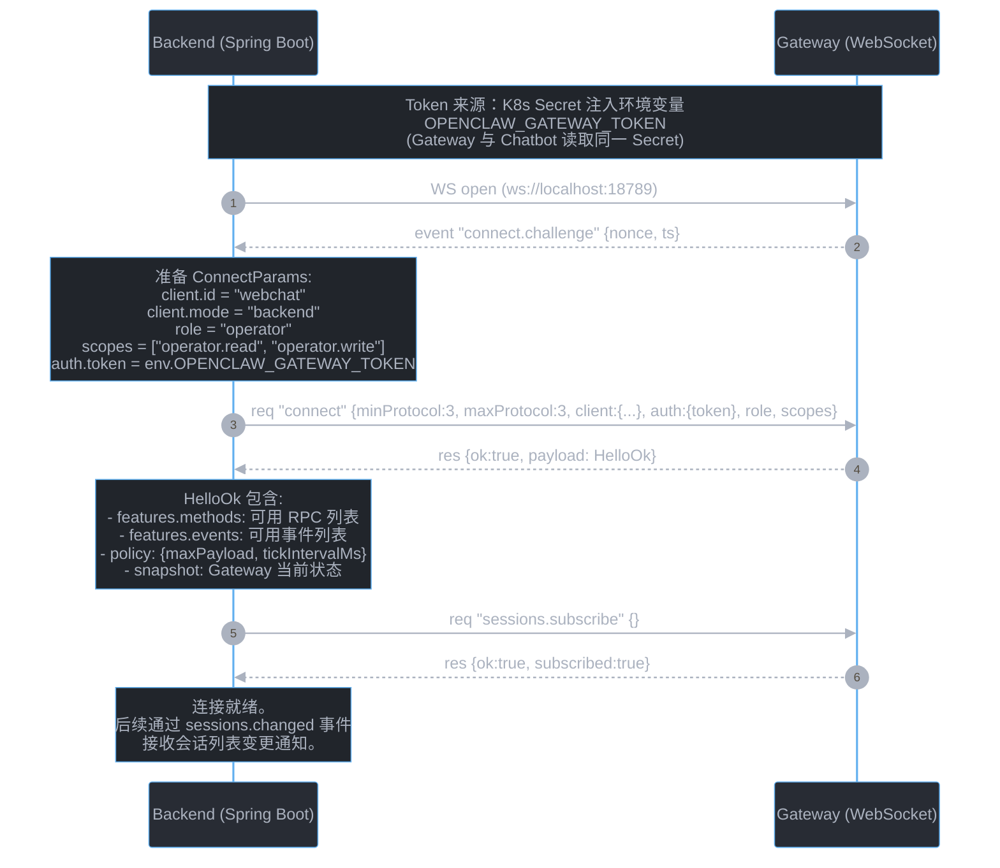
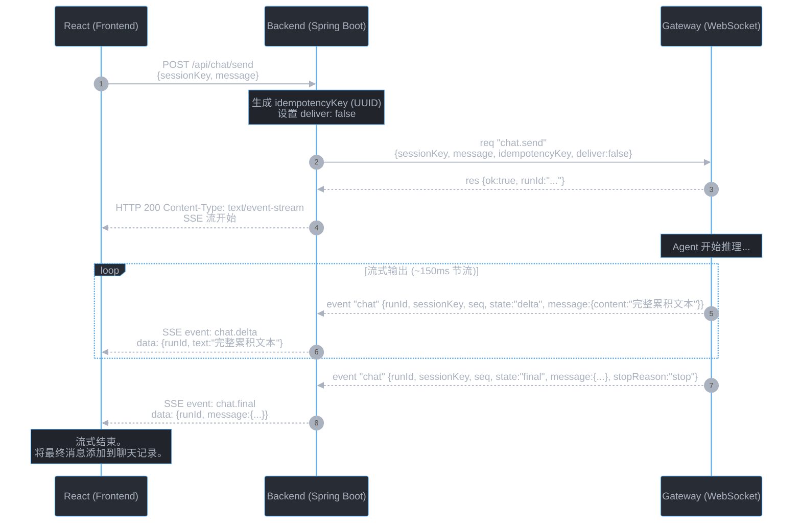
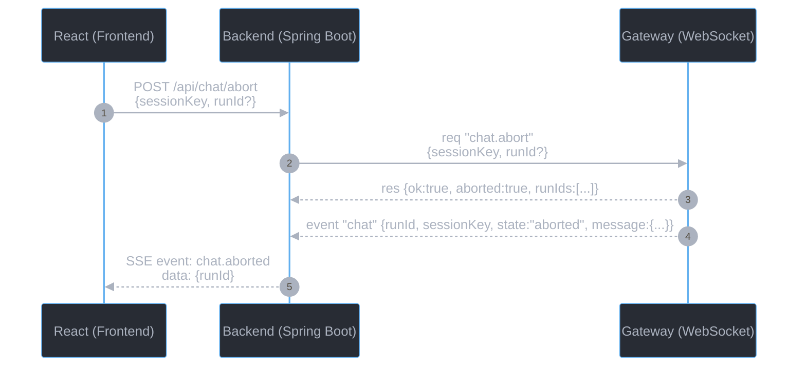
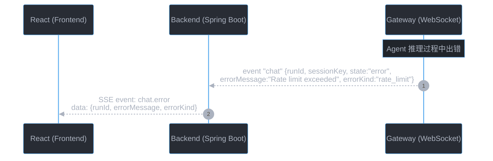
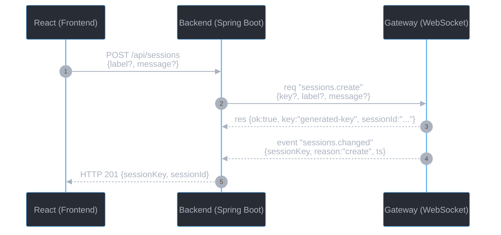
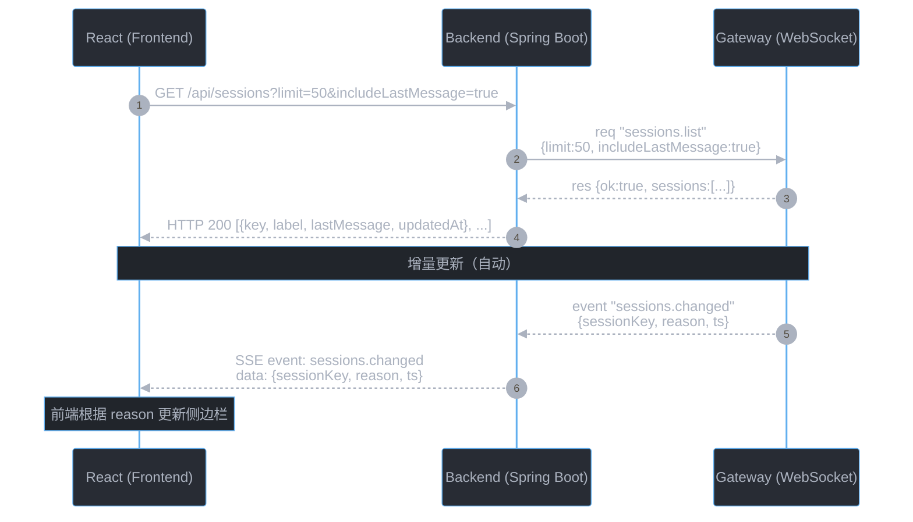
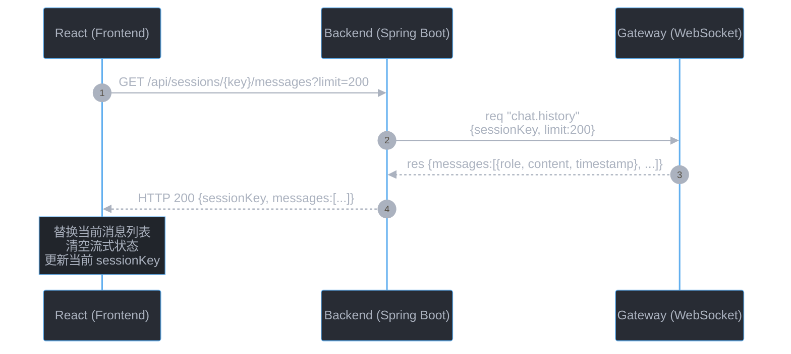
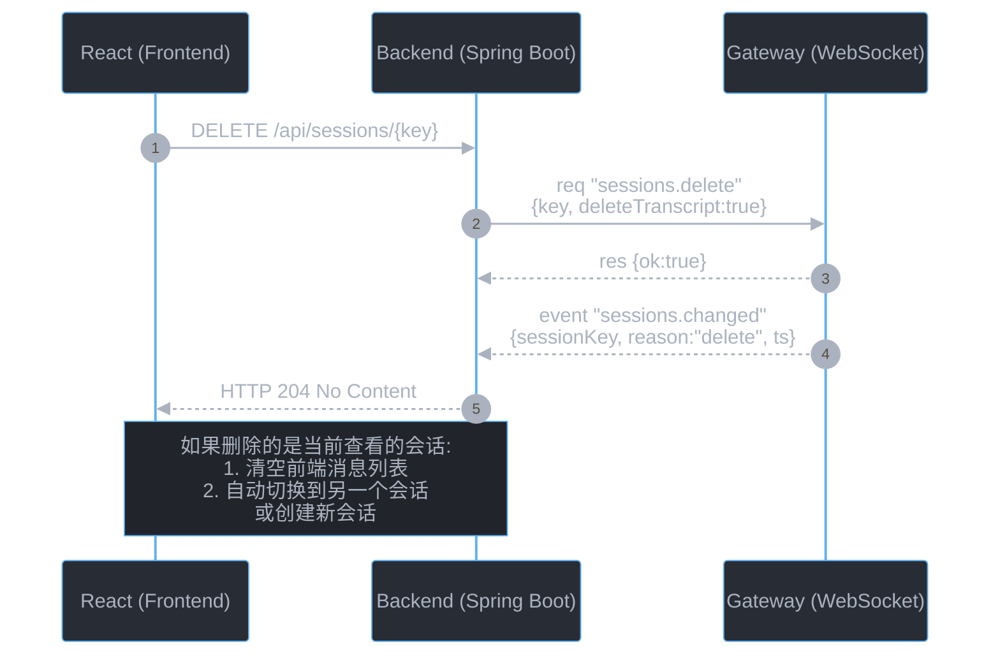

# OpenClaw Gateway Chatbot 开发参考手册

> 面向 Java/React 全栈开发者与 AI Coding 工具的协议参考与实现指南。

---

## 1. 概述

### 1.1 目标读者与适用场景

本文档面向希望基于 OpenClaw Gateway 开发定制 Web Chatbot 的开发者和 AI Coding 工具（如 Claude Code、Codex）。

**适用场景：**
- Chatbot 后端（Java Spring Boot）与 OpenClaw Gateway 部署在同一 Pod 的不同容器中
- 单用户独占实例（不存在多用户共享）
- 后端通过 **WebSocket** 与 Gateway 交互
- 浏览器前端（React）通过 **HTTP + SSE** 与 Chatbot 后端交互

**阅读方式建议：**
- 人类开发者：按顺序阅读，重点关注 Section 2 的时序图
- AI Coding 工具：直接跳转到 Section 3（协议 Reference）获取精确的字段定义和 schema

**配套文档：**
- `mydoc/openclaw-gateway-chatbot-dev-guide.md` — 接口语义说明与功能优先级（已有）
- 本文档 — 协议精确定义、时序图、接口设计建议

---

### 1.2 架构总览



**三端职责：**

| 端 | 技术栈 | 职责 |
|----|--------|------|
| React Frontend | React + SSE | 用户界面、消息渲染、会话侧边栏 |
| Spring Boot Backend | Java / Spring Boot | WS 客户端、协议翻译、HTTP→WS 桥接、SSE 推送 |
| OpenClaw Gateway | Node.js / WebSocket | Agent 运行时、会话存储、模型推理、事件广播 |

---

### 1.3 部署拓扑

```
┌─────────────────────────────────────────┐
│              Kubernetes Pod              │
│                                         │
│  ┌──────────────┐   ┌────────────────┐  │
│  │   Chatbot    │   │   OpenClaw     │  │
│  │  (Spring)    │──▶│   Gateway      │  │
│  │  :8080       │   │   :18789       │  │
│  └──────┬───────┘   └────────────────┘  │
│         │                                │
│         │ localhost                      │
└─────────┼────────────────────────────────┘
          │
          │ HTTP + SSE
          ▼
    ┌───────────┐
    │  Browser  │
    │  (React)  │
    └───────────┘
```

**关键特性：**
- Chatbot 后端与 Gateway 通过 **localhost** 通信（同 Pod 网络）
- 单用户独占：不存在多用户隔离需求
- Gateway 认证使用共享密钥（`gateway.auth.mode="token"`）
- Chatbot 后端持有 Gateway token（通过环境变量注入）

---

### 1.4 技术栈约定

| 层 | 技术 | 说明 |
|----|------|------|
| 前端 | React + EventSource API | 通过 SSE 接收流式响应 |
| 前端→后端 | HTTP/1.1 + Server-Sent Events | POST 发消息直接返回 SSE 流 |
| 后端 | Java Spring Boot | WebSocket 客户端 + HTTP Server |
| 后端→Gateway | WebSocket (JSON frames) | Gateway Protocol v3 |
| 认证（后端→Gateway） | `auth.token`（共享密钥） | 最简方案，适合独占部署 |
| 认证（前端→后端） | 可选（Pod 内信任 localhost） | 如需暴露可加 Bearer token |

---

## 2. 核心时序

> 以下时序图展示了三端（React 前端、Spring Boot 后端、Gateway）之间的核心交互链路。
> 每个场景对应 Section 3 中的精确定义。

### 2.1 认证与连接建立

后端启动时建立一条持久的 WebSocket 连接到 Gateway，完成握手后保持连接。

**认证方式选择：Token 模式**

本方案采用 Gateway 的 **Token 认证**（`gateway.auth.mode="token"`）。选择原因：

1. **最简实现**：只需一个环境变量（`GATEWAY_TOKEN`），无需实现 Ed25519 密钥对生成和挑战签名逻辑
2. **同 Pod 安全性足够**：Chatbot 与 Gateway 通过 localhost 通信，token 不经过外部网络
3. **无需 Device 签名**：operator 角色在通过共享密钥认证后，Gateway 允许省略 `device` 字段
4. **独占部署无需细粒度身份**：单用户场景不需要 device token 的设备级区分能力

其他认证方式（Password、None、Trusted Proxy、Device Token）的完整对比参见 [3.2 节认证方式对比](#3.2-connect-握手)。

以下时序图展示 Token 模式的完整握手流程：



**关键说明：**

| 要点 | 说明 |
|------|------|
| Protocol Version | 固定为 `3`，`minProtocol` 和 `maxProtocol` 都填 `3` |
| client.id | 推荐使用 `"webchat"` 或 `"gateway-client"`（参见 `src/gateway/protocol/client-info.ts` 中的 `GATEWAY_CLIENT_IDS`） |
| client.mode | 推荐使用 `"backend"`（参见 `GATEWAY_CLIENT_MODES`） |
| client.platform | 任意非空字符串，如 `"java"` 或 `"spring-boot"` |
| 认证方式 | 使用 `auth: { token: "<gateway-token>" }`，**不需要** device 签名（device 字段可省略） |
| Token 来源 | K8s Secret 注入为环境变量 `OPENCLAW_GATEWAY_TOKEN`，Gateway 与 Chatbot 读取同一 Secret |
| Token 性质 | **静态**：部署时确定，不会动态变化。更换需更新 K8s Secret 并重启 Pod |
| sessions.subscribe | 连接成功后立即调用，参数为空对象 `{}`，之后通过 `sessions.changed` 事件接收增量更新 |

**connect.challenge 事件格式：**
```json
{
  "type": "event",
  "event": "connect.challenge",
  "payload": { "nonce": "random-string", "ts": 1737264000000 }
}
```

---

### 2.2 用户发送消息（完整三端链路）

用户在聊天框输入消息后，前端通过 HTTP POST 发送到后端，后端通过 WS 转发给 Gateway。流式回复通过 SSE 推回前端。



**关键说明：**

| 要点 | 说明 |
|------|------|
| deliver: false | Chatbot 场景下设为 `false`，表示不需要通过外部队道（WhatsApp/Telegram 等）投递 |
| idempotencyKey | **必填**，使用 UUID。Gateway 会根据此值去重，防止重复发送 |
| delta 包含完整文本 | **非常重要**：`state:"delta"` 事件中的 `message.content` 是**完整的累积文本**，不是增量片段。后端应直接替换前端显示的文本，不要拼接 |
| delta 节流 | Gateway 以约 150ms 间隔发送 delta 事件 |
| seq 递增 | 每个事件的 `seq` 字段单调递增，可用于排序和去重 |
| SSE 模式 | POST 请求直接返回 SSE 流（`Content-Type: text/event-stream`），一个请求完成发送和接收 |

**后端收到 delta 时应做：**
1. 解析 `message.content` 中的文本
2. 通过 SSE 发送给前端（`event: chat.delta`）
3. 用最新 delta 的文本**替换**（不是追加）前端当前显示的流式文本

**后端收到 final 时应做：**
1. 将 `message` 作为最终 assistant 消息保存
2. 通过 SSE 发送 `event: chat.final`
3. 关闭 SSE 流（或保持连接等待下一条消息）

---

### 2.3 停止生成与错误处理

#### 停止生成



**说明：**
- `runId` 可选：如果传入，只中止指定的 run；如果省略，中止该 session 的所有活跃 run
- `aborted` 事件中 `message` 包含截至中止时已累积的文本，前端可选择展示

#### 错误处理



**errorKind 枚举值：**

| errorKind | 含义 |
|-----------|------|
| `refusal` | 模型拒绝回答 |
| `timeout` | 推理超时 |
| `rate_limit` | 触发速率限制 |
| `context_length` | 上下文超出模型限制 |
| `unknown` | 其他未知错误 |

**错误帧格式（RPC 响应）：**
```json
{
  "type": "res",
  "id": "...",
  "ok": false,
  "error": {
    "code": "AGENT_TIMEOUT",
    "message": "Agent did not respond within the configured timeout",
    "retryable": true,
    "retryAfterMs": 5000
  }
}
```

---

### 2.4 会话管理

#### 2.4.1 创建新会话



**`sessions.create` vs `sessions.reset`：**

| 操作 | 适用场景 | 说明 |
|------|---------|------|
| `sessions.create` | 创建一个全新的独立会话 | 可指定 `label`、`agentId`、`model`、`message` |
| `sessions.reset` | 在现有 sessionKey 上重置上下文 | 保持同一个 key，清空对话历史。`reason: "new"` 表示新对话 |

**建议：** 如果需要"新建对话"功能，推荐使用 `sessions.create`（不带 `key`），让 Gateway 自动生成 sessionKey。如果想在当前会话窗口内直接清空重来，使用 `sessions.reset`。

---

#### 2.4.2 展示会话列表



**说明：**
- 首次加载时调用 `sessions.list` 拉取全量列表
- 因为连接建立时已调用过 `sessions.subscribe`，后续会话变更会通过 `sessions.changed` 事件自动推送
- 前端收到 `sessions.changed` 事件后，可选择重新拉取全量列表（`sessions.list`），或根据 reason 做局部更新

**sessions.list 常用过滤参数：**

| 参数 | 类型 | 说明 |
|------|------|------|
| `limit` | integer | 最多返回条数 |
| `activeMinutes` | integer | 只返回最近 N 分钟内活跃的会话 |
| `includeLastMessage` | boolean | 包含每个会话的最后一条消息摘要（有额外的文件读取开销） |
| `includeDerivedTitles` | boolean | 从首条用户消息推导标题 |
| `search` | string | 全文搜索 |
| `agentId` | string | 按 Agent 过滤 |

---

#### 2.4.3 切换会话



**说明：**
- 切换会话的核心操作是调用 `chat.history` 拉取目标会话的消息历史
- 前端应：1) 替换消息列表；2) 清空流式文本状态；3) 更新当前 sessionKey
- 如果目标会话有正在进行的 run，delta/final 事件会因为 sessionKey 匹配而自动出现在事件流中

---

#### 2.4.4 删除会话



**说明：**
- `deleteTranscript: true` 会同时删除 transcript 文件
- 删除后，`sessions.changed` 事件会通知侧边栏刷新
- 如果删除的是当前正在查看的会话，前端需要处理"空状态"——切换到其他会话或自动创建新会话

---

## 3. WebSocket 协议 Reference

> 本节是 AI Coding 工具的主要参考区域。所有字段定义来自 Gateway 协议 schema，
> 可直接用于代码生成。

### 3.1 帧格式

Gateway 使用三种帧类型进行通信。所有帧均为 JSON 文本。

#### Request Frame（客户端 → Gateway）

```json
{
  "type": "req",
  "id": "unique-request-id",
  "method": "rpc-method-name",
  "params": { ... }
}
```

| 字段 | 类型 | 必填 | 说明 |
|------|------|------|------|
| `type` | `"req"` | 是 | 帧类型标识 |
| `id` | string (非空) | 是 | 请求唯一 ID，用于匹配响应 |
| `method` | string (非空) | 是 | RPC 方法名（如 `"chat.send"`） |
| `params` | object | 否 | 方法参数 |

#### Response Frame（Gateway → 客户端）

**成功响应：**
```json
{
  "type": "res",
  "id": "matching-request-id",
  "ok": true,
  "payload": { ... }
}
```

**失败响应：**
```json
{
  "type": "res",
  "id": "matching-request-id",
  "ok": false,
  "error": {
    "code": "AGENT_TIMEOUT",
    "message": "Agent did not respond within timeout",
    "details": null,
    "retryable": true,
    "retryAfterMs": 5000
  }
}
```

| 字段 | 类型 | 必填 | 说明 |
|------|------|------|------|
| `type` | `"res"` | 是 | 帧类型标识 |
| `id` | string (非空) | 是 | 与请求帧的 `id` 匹配 |
| `ok` | boolean | 是 | `true` 表示成功 |
| `payload` | any | 否 | 成功时的返回数据（`ok: true`） |
| `error` | ErrorShape | 否 | 失败时的错误信息（`ok: false`） |

#### ErrorShape

| 字段 | 类型 | 必填 | 说明 |
|------|------|------|------|
| `code` | string (非空) | 是 | 错误码（如 `"AGENT_TIMEOUT"`、`"INVALID_REQUEST"`） |
| `message` | string (非空) | 是 | 人类可读的错误消息 |
| `details` | any | 否 | 附加错误详情 |
| `retryable` | boolean | 否 | 是否可重试 |
| `retryAfterMs` | integer (>=0) | 否 | 建议重试等待时间（毫秒） |

#### Event Frame（Gateway → 客户端，服务端推送）

```json
{
  "type": "event",
  "event": "chat",
  "payload": { ... },
  "seq": 42,
  "stateVersion": { "presence": 1, "health": 1 }
}
```

| 字段 | 类型 | 必填 | 说明 |
|------|------|------|------|
| `type` | `"event"` | 是 | 帧类型标识 |
| `event` | string (非空) | 是 | 事件名（如 `"chat"`、`"sessions.changed"`） |
| `payload` | any | 否 | 事件数据 |
| `seq` | integer (>=0) | 否 | 单调递增的事件序列号 |
| `stateVersion` | object | 否 | 状态版本号，用于乐观并发控制 |

> 源文件：`${OPENCLAW_REPO}/src/gateway/protocol/schema/frames.ts`

---

### 3.2 Connect 握手

#### 流程概览

```
1. Client → WebSocket open
2. Gateway → event "connect.challenge" {nonce, ts}
3. Client  → req "connect" {ConnectParams}
4. Gateway → res {HelloOk}
```

#### ConnectParams（Chatbot 需要的字段）

```json
{
  "minProtocol": 3,
  "maxProtocol": 3,
  "client": {
    "id": "webchat",
    "version": "1.0.0",
    "platform": "java",
    "mode": "backend",
    "instanceId": "chatbot-instance-1"
  },
  "role": "operator",
  "scopes": ["operator.read", "operator.write"],
  "auth": {
    "token": "<GATEWAY_TOKEN>"
  },
  "locale": "zh-CN",
  "userAgent": "openclaw-chatbot/1.0.0"
}
```

| 字段 | 类型 | 必填 | Chatbot 推荐值 | 说明 |
|------|------|------|---------------|------|
| `minProtocol` | integer | 是 | `3` | 协议版本下限 |
| `maxProtocol` | integer | 是 | `3` | 协议版本上限 |
| `client.id` | string | 是 | `"webchat"` | 客户端标识（参见 `GATEWAY_CLIENT_IDS`） |
| `client.version` | string | 是 | `"1.0.0"` | 客户端版本号 |
| `client.platform` | string | 是 | `"java"` | 平台标识 |
| `client.mode` | string | 是 | `"backend"` | 客户端模式（参见 `GATEWAY_CLIENT_MODES`） |
| `client.displayName` | string | 否 | — | 人类可读名称 |
| `client.instanceId` | string | 否 | — | 实例标识（多实例部署时区分） |
| `role` | string | 否 | `"operator"` | 连接角色 |
| `scopes` | string[] | 否 | `["operator.read", "operator.write"]` | 权限范围 |
| `auth.token` | string | 否 | 环境变量注入 | Gateway 共享密钥 |
| `auth.password` | string | 否 | — | 密码认证（备选） |
| `auth.deviceToken` | string | 否 | — | 设备令牌（备选） |
| `caps` | string[] | 否 | `[]` | 能力声明 |
| `locale` | string | 否 | `"zh-CN"` | 语言区域 |
| `userAgent` | string | 否 | — | User-Agent 字符串 |

**Chatbot 场景下的简化规则：**
- 使用 `auth.token` 认证，不需要 `device` 签名
- `device` 字段可完全省略
- `role` 固定为 `"operator"`
- `scopes` 使用默认的 `["operator.read", "operator.write"]` 即可覆盖所有 Chatbot 操作

#### 认证方式对比

Gateway 支持 5 种认证方式（由 `gateway.auth.mode` 配置决定），每种方式的凭证和 Device 签名要求不同：

| 认证方式 | `auth` 字段 | Device 签名 | 适用场景 | 推荐度 |
|----------|------------|------------|---------|--------|
| **token** | `{token: "shared-secret"}` | 可省略 | 同 Pod / 私有网络部署 | **Chatbot 推荐** |
| **password** | `{password: "shared-password"}` | 可省略 | 同 token，用密码替代 | 备选 |
| **none** | `{}` 或省略 | **必须** | 纯 localhost / 开发环境 | 不推荐（实现复杂） |
| **trusted-proxy** | 由代理注入 HTTP 头 | 可省略 | Gateway 前面有身份代理 | 企业部署 |
| **device-token** | `{deviceToken: "issued-token"}` | **必须** | 首次配对后的持久重连 | 移动端/桌面端 |

**Device 签名可省略的条件：** 当 `role="operator"` 且提供了有效的共享密钥（token 或 password）时，Gateway 允许省略 `device` 字段（源码：`roleCanSkipDeviceIdentity("operator", sharedAuthOk=true)` 返回 `true`）。这意味着 Chatbot 后端不需要实现密钥对生成和挑战签名逻辑。

##### Token 模式（推荐）

```
配置: gateway.auth.mode="token", gateway.auth.token="${GATEWAY_TOKEN}"

Backend → WS open
Gateway → event "connect.challenge" {nonce, ts}
Backend → req "connect" {auth:{token:"${GATEWAY_TOKEN}"}, device:省略, ...}
Gateway → 验证 token → res {ok:true, hello-ok}
```

- 一个环境变量完成认证，无需密码学签名
- 同 Pod 内 token 不经过外部网络
- Chatbot 无状态，不需要 device token 持久化

##### Password 模式

```
配置: gateway.auth.mode="password", gateway.auth.password="..."

ConnectParams.auth = {password: "..."}
```

流程与 token 完全一致，只是凭证字段不同。Device 签名同样可省略。

##### None 模式（无认证）

```
配置: gateway.auth.mode="none"

ConnectParams.auth = {} (省略)
ConnectParams.device = {id, publicKey, signature, signedAt, nonce}  ← 必须！
```

没有共享密钥时，`device` 签名是唯一的信任锚。必须实现：
1. 生成 Ed25519 密钥对
2. 收到 `connect.challenge` 后用私钥签名 nonce
3. 在 connect 帧中发送 `device.id`、`device.publicKey`、`device.signature`、`device.signedAt`、`device.nonce`

实现复杂度显著高于 token 模式，且安全性不优于 token（同样依赖单因素）。**不推荐 Chatbot 使用。**

##### Trusted Proxy 模式

```
配置: gateway.auth.mode="trusted-proxy" + 可信代理配置

客户端 → 可信代理（注入 x-openclaw-scopes 等身份头）
代理 → Gateway（携带身份头）
Gateway → 验证请求来源 → connect.challenge
客户端 → connect {无需 auth 凭证}
Gateway → 从代理头解析身份 → hello-ok
```

需要额外部署身份代理，适合已有企业 SSO / API Gateway 的场景。Chatbot 同 Pod 部署通常不需要。

##### Device Token 模式（持久化重连）

这不是独立的 auth mode，而是首次通过其他模式认证成功后，Gateway 在 `hello-ok` 中颁发的持久令牌：

```json
{
  "auth": {
    "deviceToken": "issued-token",
    "role": "operator",
    "scopes": ["operator.read", "operator.write"]
  }
}
```

后续重连时使用 `auth: {deviceToken: "issued-token"}`，但**必须同时提供 device 签名**。适合需要持久设备身份的移动端/桌面端应用。Chatbot 后端是无状态服务，通常不需要此模式。

#### HelloOk 响应

```json
{
  "type": "hello-ok",
  "protocol": 3,
  "server": {
    "version": "2025.4.15",
    "connId": "conn-abc123"
  },
  "features": {
    "methods": ["chat.send", "chat.history", "sessions.list", ...],
    "events": ["chat", "sessions.changed", "tick", ...]
  },
  "snapshot": { ... },
  "policy": {
    "maxPayload": 1048576,
    "maxBufferedBytes": 8388608,
    "tickIntervalMs": 15000
  }
}
```

| 字段 | 类型 | 说明 |
|------|------|------|
| `protocol` | integer | 协议版本（应为 `3`） |
| `server.version` | string | Gateway 版本号 |
| `server.connId` | string | 连接唯一标识 |
| `features.methods` | string[] | 该 Gateway 实例支持的所有 RPC 方法名 |
| `features.events` | string[] | 该 Gateway 实例支持的所有事件名 |
| `snapshot` | object | Gateway 当前状态快照（presence、health 等） |
| `policy.maxPayload` | integer | 最大 payload 字节数 |
| `policy.maxBufferedBytes` | integer | 最大缓冲字节数 |
| `policy.tickIntervalMs` | integer | 心跳间隔（毫秒），默认 15000 |

> 源文件：`${OPENCLAW_REPO}/src/gateway/protocol/schema/frames.ts`

---

### 3.3 Chat RPC

#### chat.send

发送用户消息，触发 Agent 推理。

**参数：**

```json
{
  "sessionKey": "session-key-or-empty-for-default",
  "message": "Hello, how are you?",
  "idempotencyKey": "uuid-v4-string",
  "deliver": false
}
```

| 字段 | 类型 | 必填 | 说明 |
|------|------|------|------|
| `sessionKey` | string (1-512 chars) | 是 | 目标会话 key。空字符串 `""` 使用默认会话 |
| `message` | string | 是 | 用户消息内容 |
| `idempotencyKey` | string (非空) | **是** | 幂等键，必须为 UUID。Gateway 据此去重 |
| `deliver` | boolean | 否 | 是否通过外部队道投递。Chatbot 场景设为 `false` |
| `thinking` | string | 否 | 预填充的思考内容 |
| `timeoutMs` | integer (>=0) | 否 | 超时覆盖（毫秒） |
| `attachments` | array | 否 | 附件列表（后续扩展） |

**响应：**
```json
{
  "ok": true,
  "runId": "run-uuid",
  "status": "started"
}
```

如果 `idempotencyKey` 重复，响应为：
```json
{
  "ok": true,
  "status": "in_flight",
  "runId": "existing-run-uuid"
}
```

#### chat.history

拉取指定会话的消息历史。

**参数：**

```json
{
  "sessionKey": "target-session-key",
  "limit": 200,
  "maxChars": 12000
}
```

| 字段 | 类型 | 必填 | 说明 |
|------|------|------|------|
| `sessionKey` | string (非空) | 是 | 目标会话 key |
| `limit` | integer (1-1000) | 否 | 最多返回消息条数 |
| `maxChars` | integer (1-500000) | 否 | 最大返回字符数（默认约 12000） |

**响应：** 返回消息数组，每条消息包含 `role`、`content`、`timestamp` 等字段。Silent reply（如 `NO_REPLY`）会被过滤。

#### chat.abort

中止正在进行的 chat run。

**参数：**

```json
{
  "sessionKey": "target-session-key",
  "runId": "optional-specific-run-id"
}
```

| 字段 | 类型 | 必填 | 说明 |
|------|------|------|------|
| `sessionKey` | string (非空) | 是 | 目标会话 key |
| `runId` | string (非空) | 否 | 指定要中止的 run。省略则中止该会话所有活跃 run |

**响应：**
```json
{
  "ok": true,
  "aborted": true,
  "runIds": ["run-uuid-1", "run-uuid-2"]
}
```

> 源文件：`${OPENCLAW_REPO}/src/gateway/protocol/schema/logs-chat.ts`

---

### 3.4 Session RPC

#### sessions.subscribe

订阅会话索引变更事件。连接成功后调用一次即可。

**参数：** `{}`（空对象）

**响应：** `{ ok: true, subscribed: true }`

之后，任何会话的增删改都会触发 `sessions.changed` 事件。

#### sessions.list

查询会话列表。

**参数：**

```json
{
  "limit": 50,
  "activeMinutes": 10080,
  "includeLastMessage": true,
  "includeDerivedTitles": true,
  "search": "optional-search-term",
  "agentId": "optional-agent-id"
}
```

| 字段 | 类型 | 必填 | 说明 |
|------|------|------|------|
| `limit` | integer (>=1) | 否 | 最多返回条数 |
| `activeMinutes` | integer (>=1) | 否 | 只返回最近 N 分钟内活跃的会话 |
| `includeGlobal` | boolean | 否 | 包含全局会话 |
| `includeUnknown` | boolean | 否 | 包含未标记会话 |
| `includeLastMessage` | boolean | 否 | 每个会话附带最后一条消息摘要 |
| `includeDerivedTitles` | boolean | 否 | 从首条消息推导标题 |
| `label` | string | 否 | 按 label 过滤 |
| `search` | string | 否 | 全文搜索 |
| `agentId` | string | 否 | 按 Agent ID 过滤 |
| `spawnedBy` | string | 否 | 按父会话过滤 |

**响应：** 返回会话索引数组，每个条目包含 `key`、`label`、`lastMessage`（如请求）、活跃时间等。

#### sessions.create

创建新会话。

**参数：**

```json
{
  "key": "optional-custom-key",
  "label": "My Chat Session",
  "agentId": "optional-agent",
  "model": "optional-model-override",
  "message": "Optional initial message"
}
```

| 字段 | 类型 | 必填 | 说明 |
|------|------|------|------|
| `key` | string | 否 | 自定义会话 key。省略则自动生成 |
| `label` | string | 否 | 会话标签（显示名称） |
| `agentId` | string | 否 | 指定 Agent |
| `model` | string | 否 | 模型覆盖 |
| `parentSessionKey` | string | 否 | 父会话 key（分叉场景） |
| `task` | string | 否 | 初始任务描述 |
| `message` | string | 否 | 初始用户消息（会立即触发 Agent 回复） |

**响应：** `{ ok: true, key: "generated-or-custom-key", sessionId: "..." }`

#### sessions.reset

重置指定会话的上下文（清空对话历史，保留 sessionKey）。

**参数：**

```json
{
  "key": "target-session-key",
  "reason": "new"
}
```

| 字段 | 类型 | 必填 | 说明 |
|------|------|------|------|
| `key` | string (非空) | 是 | 要重置的会话 key |
| `reason` | `"new"` \| `"reset"` | 否 | 重置原因（默认 `"new"`） |

#### sessions.delete

删除指定会话。

**参数：**

```json
{
  "key": "target-session-key",
  "deleteTranscript": true
}
```

| 字段 | 类型 | 必填 | 说明 |
|------|------|------|------|
| `key` | string (非空) | 是 | 要删除的会话 key |
| `deleteTranscript` | boolean | 否 | 是否同时删除 transcript 文件（默认 `false`） |

#### sessions.patch

更新会话元数据。

**参数（常用字段）：**

```json
{
  "key": "target-session-key",
  "label": "New Session Name",
  "model": "sonnet-4.6"
}
```

| 字段 | 类型 | 必填 | 说明 |
|------|------|------|------|
| `key` | string (非空) | 是 | 目标会话 key |
| `label` | string \| null | 否 | 更新标签（null 清除） |
| `model` | string \| null | 否 | 切换模型 |
| `thinkingLevel` | string \| null | 否 | 思考级别 |
| `fastMode` | boolean \| null | 否 | 快速模式开关 |
| `verboseLevel` | string \| null | 否 | 详细级别 |

> 源文件：`${OPENCLAW_REPO}/src/gateway/protocol/schema/sessions.ts`

---

### 3.5 Event 类型

Gateway 通过 Event Frame 主动推送事件给已连接的客户端。

#### chat

聊天流式事件，用于推送 Agent 的实时响应。

**Payload：**

```json
{
  "runId": "run-uuid",
  "sessionKey": "session-key",
  "seq": 5,
  "state": "delta",
  "message": {
    "role": "assistant",
    "content": [{ "type": "text", "text": "完整累积文本到这里" }],
    "timestamp": 1737264000000
  }
}
```

| 字段 | 类型 | 说明 |
|------|------|------|
| `runId` | string (非空) | 本次运行的唯一 ID |
| `sessionKey` | string (非空) | 所属会话 key |
| `seq` | integer (>=0) | 事件序列号（单调递增） |
| `state` | `"delta"` \| `"final"` \| `"aborted"` \| `"error"` | 事件状态 |
| `message` | object | 消息内容（delta 和 final 时有值） |
| `errorMessage` | string | 错误消息（error 时有值） |
| `errorKind` | string | 错误类型（error 时有值） |
| `usage` | object | Token 使用量（final 时可能有值） |
| `stopReason` | string | 停止原因（final 时有值，如 `"stop"`） |

**状态机：**

```
                   ┌──────────────────────┐
                   │                      │
          ┌───────▶│       delta          │───────┐
          │        │  (流式输出中)         │       │
          │        └──────────────────────┘       │
          │                │                      │
   用户发送消息        多次 delta               Agent 完成
   chat.send          (约150ms间隔)              或出错
          │                │                      │
          │        ┌───────▼──────┐        ┌──────▼──────┐
          │        │              │        │             │
          └────────│    final     │        │   aborted   │
                   │  (完成)      │        │  (被中止)    │
                   └──────────────┘        └─────────────┘
                                             ┌──────────┐
                                             │          │
                                             │   error   │
                                             │  (出错)   │
                                             └──────────┘
```

**关键语义：**
- **delta**：包含**完整累积文本**（不是增量片段）。每次 delta 的 `message.content` 是从开头到当前位置的完整文本。后端应替换（不是追加）前端显示的流式文本
- **final**：流式输出完成。`message` 包含最终完整消息。`stopReason` 说明结束原因
- **aborted**：生成被中止（用户主动或超时）。`message` 包含截至中止时的累积文本
- **error**：生成出错。`errorMessage` 提供错误描述，`errorKind` 提供错误分类

#### sessions.changed

会话索引变更通知。当任何会话被创建、删除、重置或修改时触发。

**Payload：** 包含变更的会话 key、变更原因和时间戳。

前端收到后应刷新会话列表（重新调用 `sessions.list`），或根据 reason 做局部更新。

#### session.message

单会话级别的消息/transcript 更新事件。比 `chat` 事件更细粒度，关注 transcript 的持久化状态。

#### tick

周期性心跳事件，间隔由 `HelloOk.policy.tickIntervalMs` 决定（默认 15000ms）。

**Payload：** `{ ts: number }`

#### shutdown

Gateway 即将关闭。

**Payload：**
```json
{
  "reason": "restart",
  "restartExpectedMs": 5000
}
```

| 字段 | 类型 | 说明 |
|------|------|------|
| `reason` | string (非空) | 关闭原因 |
| `restartExpectedMs` | integer (>=0) | 预计重启时间（毫秒，可选） |

> 源文件：`${OPENCLAW_REPO}/src/gateway/protocol/schema/frames.ts`, `${OPENCLAW_REPO}/src/gateway/protocol/schema/logs-chat.ts`

---

## 4. HTTP + SSE 接口设计建议（Browser ↔ Backend）

> 本节定义 Chatbot 后端（Spring Boot）向 React 前端暴露的 HTTP API。
> 这些接口是**建议设计**，后端开发者可根据实际需求调整。

### 4.1 认证方案建议

**推荐方案：Pod 内部无认证**

由于前端与后端在同 Pod 的 localhost 网络中通信，且为单用户独占实例，HTTP 层面可以不设认证。

**备选方案：Bearer Token**

如果前端需要从集群外访问后端，建议添加简单的 Bearer Token 认证：

```
Authorization: Bearer <API_KEY>
```

`API_KEY` 通过环境变量配置，与 Gateway token 独立。

---

### 4.2 消息相关

#### POST /api/chat/send

发送用户消息并接收流式回复。

**请求：**
```
POST /api/chat/send
Content-Type: application/json

{
  "sessionKey": "current-session-key",
  "message": "Hello!"
}
```

**响应：** 直接返回 SSE 流

```
HTTP/1.1 200 OK
Content-Type: text/event-stream
Cache-Control: no-cache
Connection: keep-alive

event: chat.delta
data: {"runId":"run-abc","text":"Hello"}

event: chat.delta
data: {"runId":"run-abc","text":"Hello! How can I help you today?"}

event: chat.final
data: {"runId":"run-abc","message":{"role":"assistant","content":"Hello! How can I help you today?","timestamp":1737264000000}}
```

**后端处理流程：**
1. 接收 HTTP POST
2. 生成 `idempotencyKey`（UUID）
3. 通过 WS 发送 `chat.send` RPC
4. 收到 `ok: true` 后，将 HTTP 响应切换为 SSE 流
5. 监听 WS `chat` 事件，将 delta/final/aborted/error 转发为 SSE 事件
6. 收到 `final`/`aborted`/`error` 后结束 SSE 流

#### POST /api/chat/abort

中止当前生成。

**请求：**
```json
{
  "sessionKey": "current-session-key",
  "runId": "optional-specific-run"
}
```

**响应：**
```json
{
  "aborted": true,
  "runIds": ["run-abc"]
}
```

---

### 4.3 会话管理

#### GET /api/sessions

获取会话列表。

**请求：**
```
GET /api/sessions?limit=50&includeLastMessage=true
```

**响应：**
```json
[
  {
    "key": "session-1",
    "label": "Chat about TypeScript",
    "lastMessage": "Can you explain generics?",
    "updatedAt": "2025-04-15T10:30:00Z"
  },
  {
    "key": "session-2",
    "label": "New Chat",
    "lastMessage": null,
    "updatedAt": "2025-04-14T18:00:00Z"
  }
]
```

#### POST /api/sessions

创建新会话。

**请求：**
```json
{
  "label": "My New Chat",
  "message": "Optional initial message"
}
```

**响应：**
```
HTTP/1.1 201 Created

{
  "sessionKey": "generated-key"
}
```

#### GET /api/sessions/{key}/messages

获取指定会话的消息历史。

**请求：**
```
GET /api/sessions/{key}/messages?limit=200
```

**响应：**
```json
{
  "sessionKey": "session-1",
  "messages": [
    {
      "role": "user",
      "content": "Hello!",
      "timestamp": "2025-04-15T10:00:00Z"
    },
    {
      "role": "assistant",
      "content": "Hi! How can I help you?",
      "timestamp": "2025-04-15T10:00:05Z"
    }
  ]
}
```

#### POST /api/sessions/{key}/reset

重置指定会话（清空上下文）。

**请求：**
```json
{
  "reason": "new"
}
```

**响应：**
```json
{
  "ok": true
}
```

#### DELETE /api/sessions/{key}

删除指定会话。

**请求：**
```
DELETE /api/sessions/{key}?deleteTranscript=true
```

**响应：**
```
HTTP/1.1 204 No Content
```

---

### 4.4 SSE 事件格式

后端通过 SSE 向前端推送的事件格式统一如下：

#### 聊天事件

| SSE event | 触发条件 | Data 格式 |
|-----------|---------|-----------|
| `chat.delta` | WS 收到 `chat` event state=`delta` | `{runId, text}` |
| `chat.final` | WS 收到 `chat` event state=`final` | `{runId, message}` |
| `chat.aborted` | WS 收到 `chat` event state=`aborted` | `{runId}` |
| `chat.error` | WS 收到 `chat` event state=`error` | `{runId, errorMessage, errorKind}` |

#### 会话事件

| SSE event | 触发条件 | Data 格式 |
|-----------|---------|-----------|
| `sessions.changed` | WS 收到 `sessions.changed` event | `{sessionKey, reason, ts}` |

#### 控制事件

| SSE event | 触发条件 | Data 格式 |
|-----------|---------|-----------|
| `:keepalive` | 每 15 秒 | （SSE 注释，无 data） |
| `error` | 后端内部错误 | `{message, code}` |

**SSE 注释（keepalive）格式：**
```
: keepalive

```

**前端 EventSource 使用注意：**
- `POST /api/chat/send` 返回 SSE 流时，不能使用浏览器原生 `EventSource`（它只支持 GET）。需使用 `fetch()` + `ReadableStream` 或第三方库（如 `@microsoft/fetch-event-source`）
- 会话变更事件需要独立的 SSE 连接（如 `GET /api/events`），或通过轮询 `GET /api/sessions` 实现

---

## 5. 源代码索引

> 以下路径使用 `${OPENCLAW_REPO}` 作为仓库根目录变量。

### 5.1 协议 Schema 文件

| 文件 | 用途 |
|------|------|
| `${OPENCLAW_REPO}/src/gateway/protocol/schema/frames.ts` | WS 帧格式（Request/Response/Event）、ConnectParams、HelloOk、ErrorShape |
| `${OPENCLAW_REPO}/src/gateway/protocol/schema/logs-chat.ts` | Chat RPC 参数（ChatSendParams、ChatAbortParams、ChatHistoryParams）、ChatEvent schema |
| `${OPENCLAW_REPO}/src/gateway/protocol/schema/sessions.ts` | Session RPC 参数（SessionsCreateParams、SessionsListParams、SessionsResetParams、SessionsDeleteParams、SessionsPatchParams 等） |
| `${OPENCLAW_REPO}/src/gateway/protocol/schema/primitives.ts` | 共享类型定义（NonEmptyString、GatewayClientId、GatewayClientMode 等） |
| `${OPENCLAW_REPO}/src/gateway/protocol/schema/protocol-schemas.ts` | Schema 注册表，导出所有 schema 的汇总入口 |
| `${OPENCLAW_REPO}/src/gateway/protocol/client-info.ts` | `GATEWAY_CLIENT_IDS` 和 `GATEWAY_CLIENT_MODES` 常量定义 |

### 5.2 参考实现文件

| 文件 | 用途 |
|------|------|
| `${OPENCLAW_REPO}/docs/gateway/protocol.md` | Gateway 协议完整文档（握手、帧格式、认证、RPC 方法列表） |
| `${OPENCLAW_REPO}/src/gateway/server-methods/sessions.ts` | Session RPC 的服务端实现（了解 Gateway 的实际行为） |
| `${OPENCLAW_REPO}/src/gateway/sessions-history-http.ts` | 现有 SSE HTTP 端点实现（`/sessions/{key}/history`），可参考 SSE 写入格式和认证方式 |
| `${OPENCLAW_REPO}/docs/gateway/openai-http-api.md` | Gateway HTTP API 认证方式说明（Bearer token、trusted proxy 等） |

### 5.3 后续扩展

以下功能在本文档中标记为"后续扩展"，当前未详细展开：

- **附件上传**：`chat.send` 的 `attachments` 参数支持图片和文件附件。实现需要处理文件上传、MIME 类型、大小限制等
- **WebSocket 断线重连**：当前未设计。如果需要，后端应实现指数退避重连，并在重连后重新执行握手流程（challenge → connect → subscribe）
- **并发消息控制**：当前建议在 AI 回复未完成时禁用发送按钮，避免并发问题
- **会话搜索**：`sessions.list` 的 `search` 参数支持全文搜索，前端可实现搜索框
- **Usage 统计**：`sessions.usage`、`sessions.usage.timeseries`、`sessions.usage.logs` 支持 token 消耗和成本可视化

